# HASAN AGHAEI

---

## Hybrid Ensemble Learning: Classification and Clustering

## Project Overview

This project implements a **hybrid (ensemble) classifier** based on the aggregation of both supervised and unsupervised learning methods.

### Ensemble Classification Methods

- **MLP Neural Network** - Multi-layer Perceptron
- **RBF Neural Network** - Radial Basis Function Network
- **k-NN Algorithm** - k-Nearest Neighbors
- **GP Algorithm** - Gaussian Process Classifier
- **Naïve Bayes Algorithm** - Gaussian Naive Bayes

### Ensemble Clustering Methods

- **k-Means Algorithm**
- **k-Medoids Algorithm**
- **DIANA Algorithm** - Divisive Analysis

### Datasets

- **RCV1 (Reuters)** - Text classification dataset
- **Forest Covtype** - Forest cover type prediction dataset

### Evaluation Metrics

- **Classification**: Accuracy, Precision, Sensitivity (Recall)
- **Clustering**: Rand Index, F-measure

---

### Reports

after installing and importing the packages we need, we must load the data sets as below :

- RCV1 (Reuters) - Text classification dataset
  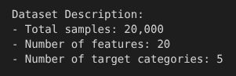
  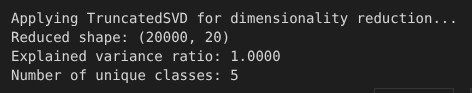

- Forest Covtype - Forest cover type prediction dataset
  
  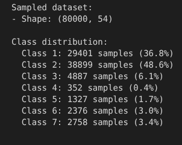

after the loading the data we must split to test and train for both datasets:
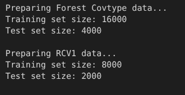

we need to train on the COVTYPE dataset and the optimal parameters as below:
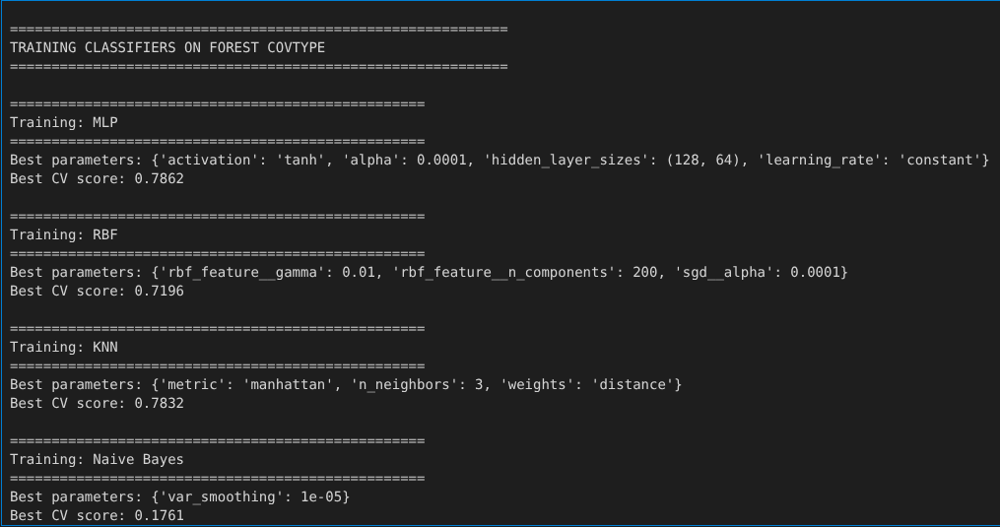
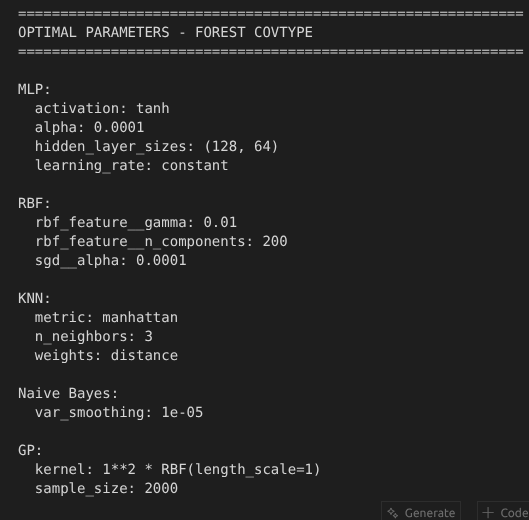

results on COVTYPE as below:
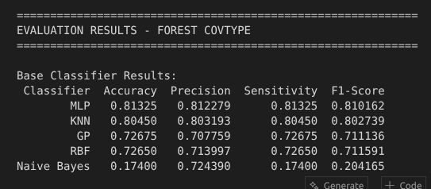

if you want a better view you can see this chart:
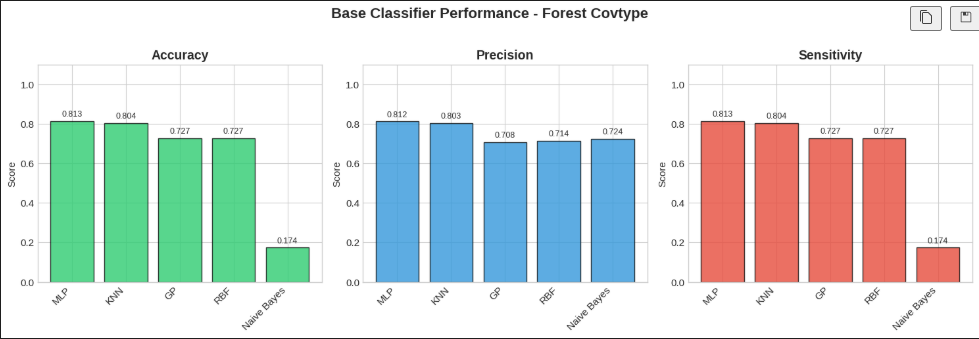

after that we must find the proper weight of each model for ensemble Learner:
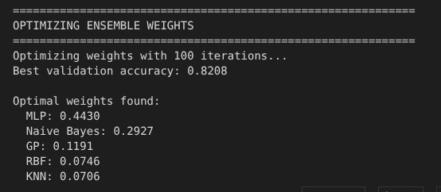

and when we show the ensemble learner aside the base single learner we head to this chart:
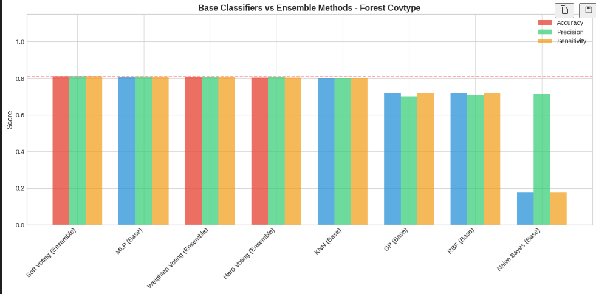

---

after that for clustering algorithms we have:
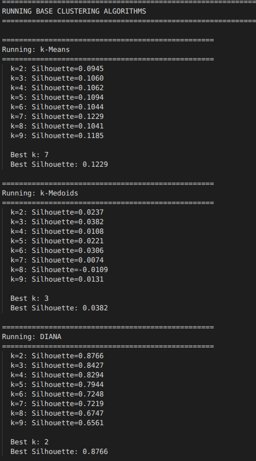

and their optimal parameters.
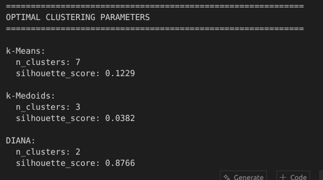

the results for clustering algorithms
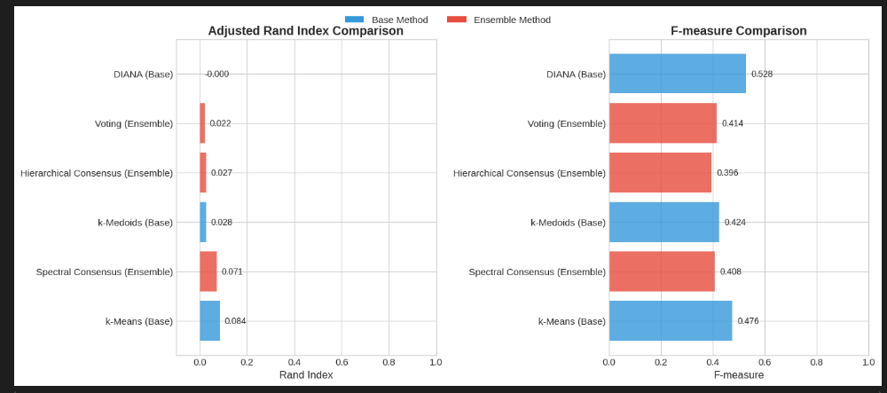

---

### Conclusion

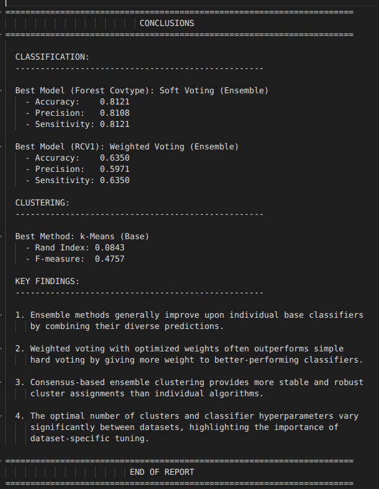
